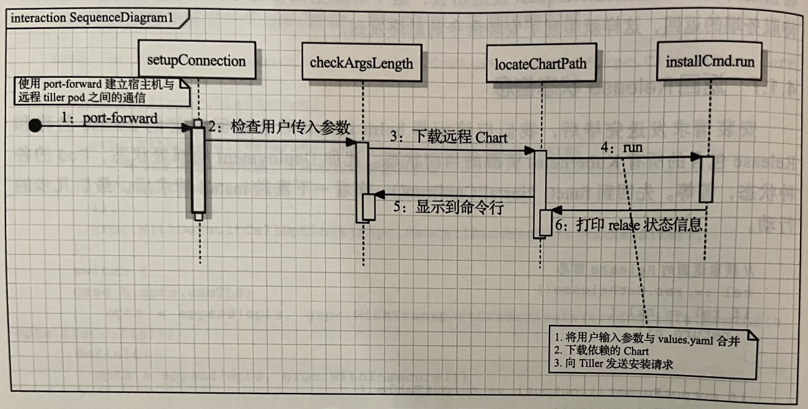
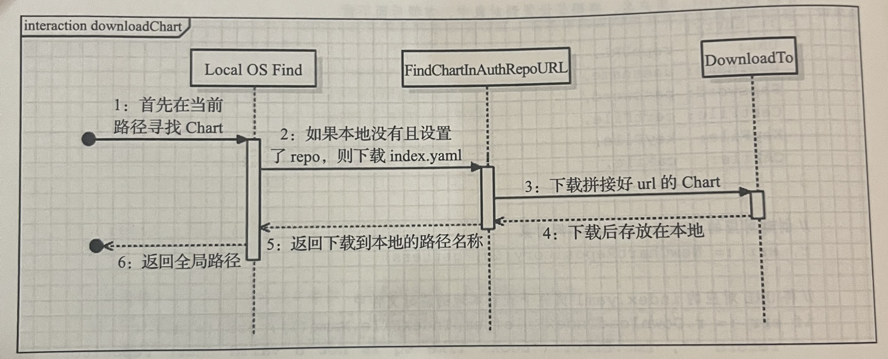

# Helm源码分析
Source Code From https://github.com/helm/helm/archive/refs/tags/v2.17.0.tar.gz

参考云原生应用管理原理与实践（陈显鹭 阚俊宝 匡大虎 卢稼奇 著）

## 目录
-   [Helm源码分析](#helm源码分析)
    -   [目录](#目录)
    -   [Helm Install Client](#helm-install-client)
        -   [locateChartPath](#locatechartpath)
        -   [ensureHelmClient](#ensurehelmclient)
        -   [InstallCmd Run](#installcmd-run)
        -   [installReleaseFromChart](#installreleasefromchart)
        -   [setupConnection](#setupconnection)
        -   [Helm Client install
            Function](#helm-client-install-function)
        -   [返回Release状态](#返回release状态)

## Helm Install Client
cmd\helm\install.go:172

1.提前使用kubectl port-forward功能打通宿主机与远程Tiller Pod的通信。

2.checkArgsLength检查用户输入参数的合法性。

3.对于远程地址，locateChartPath下载Chart到本地指定目录；对于本地地址，则直接加载。

4.installCmd.run将用户命令行输入参数覆盖values.yaml信息，下载依赖的Chart，将Chart信息加载到内存中变成结构体信息。

5.向Tiller发送install命令，将含有Chart所有信息的结构体发送出去。

6.打印Tiller返回的Release信息。

7.向Tiller发送获取Release Status信息并且打印出来。

### locateChartPath
cmd\helm\install.go:491

pkg\repo\chartrepo.go:206

### ensureHelmClient
cmd\helm\helm.go:421, 430

### InstallCmd Run

cmd\helm\install.go:242

1.处理helm install命令行临时覆盖的参数

2.处理外部介入的template

3.检查指定的Release名称是否符合DNS命名规范

4.加载Chart文件并且初始化为Chart对象

5.加载requirements.yaml文件内声明的依赖Chart

### installReleaseFromChart
pkg\helm\client.go:112

### setupConnection
cmd\helm\install.go:177

cmd\helm\helm.go:341

### Helm Client install Function
pkg\helm\client.go:422,361

pkg\proto\hapi\services\tiller.pb.go:1566

### 返回Release状态
cmd\helm\install.go:357

